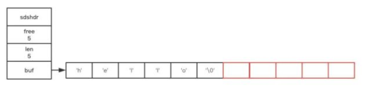
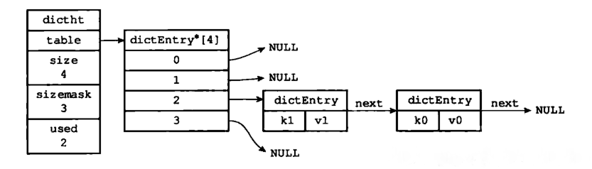

1.redis概述
------
        1.Redis 是一个基于内存的高性能key-value数据库。
        2.redis是一个非关系型的数据库(not-only-sql即nosql),以键值对的方式存储数据,将数据存放在内存中,存取速度快,但是对持久化的支持不够好,
            所以redis一般配合关系型数据库使用,redis可以做分布式缓存,用在数据量大,高并发的情况下.redis通过很多命令进行操作,
            而且redis不适合保存内容大的数据.
2.redis五种数据类型
------
        1.String/字符串:最常规的 set/get 操作，Value 可以是 String 也可以是数字。一般做一些复杂的计数功能的缓存。使用场景：常规key-value缓存应用。常规计数: 微博数, 粉丝数
        2.Hash/字典:这里 Value 存放的是结构化的对象，比较方便的就是操作其中的某个字段。我在做单点登录的时候，就是用这种数据结构存储用户信息，以 CookieId 作为 Key，设置 30 分钟为缓存过期时间，能很好的模拟出类似 Session 的效果
        3.List/列表:使用List结构，我们可以轻松地实现最新消息排行等功能。List的另一个应用就是消息队列
        4.Set/集合:因为 Set 堆放的是一堆不重复值的集合。所以可以做全局去重的功能。例如:点赞点踩
        5.Sorted Set/有序集合:Sorted Set多了一个权重参数 Score，集合中的元素能够按 Score 进行排列。可以做排行榜应用。
        6.HyperLogLog :HyperLogLog 用于统计基数
        
3.redis数据类型-String-使用-底层实现原理
------
        string是redis最基本的类型，你可以理解成与Memcached一模一样的类型，一个key对应一个value。
        string类型是二进制安全的。意思是redis的string可以包含任何数据。比如jpg图片或者序列化的对象 。
        string类型是Redis最基本的数据类型，一个键最大能存储512MB。
        
        命令：
            SET Key Value 
            GET Key Value
            
        redis的底层是C语言，但是String并非使用的C语言中的字符串，而是Redis自己实现了一种“简单动态字符串”Simple dynamic string，减乘SDS
        数据结构如下：
                struct sdshdr{
                	int len;	//记录已使用长度
                	int free;	//记录未使用长度
                	char[] buf;	//字符数组 个人理解为指向一个字符数组的指针char* buf
                };

                
        redis的字符串也会遵守C语言的字符串的实现规则，即最后一个字符为空字符。然而这个空字符不会被计算在len里头。
        SDS的最厉害最奇妙之处在于它的Dynamic。动态变化长度。在进行扩容时会进行如下步骤：
            1.计算出所需的大小是否足够
            2.开辟空间至满足所需大小
            3.开辟已使用大小len相同长度的空闲free空间（如果len < 1m），开启1m长度的空闲free空间（如果len>=1m）。

        Redis 字符串的性能优势：
                1.快速获取字符串长度(因为数据结构里面保存了字符串的长度)
                2.避免缓冲区溢出
                3.降低空间分配次数提升内存使用效率
                空间预分配：对于追加操作来说，Redis不仅会开辟空间至够用而且还会预分配未使用的空间(free)来用于下一次操作。
                    至于未使用的空间(free)的大小则由修改后的字符串长度决定。当修改后的字符串长度len < 1M,则会分配与len相同长度的未使用的空间(free)
                    当修改后的字符串长度len >= 1M,则会分配1M长度的未使用的空间(free)有了这个预分配策略之后会减少内存分配次数，
                    因为分配之前会检查已有的free空间是否够，如果够则不开辟了。
                惰性空间回收：与上面情况相反，惰性空间回收适用于字符串缩减操作。
                    比如有个字符串s1=“hello world”，对s1进行sdstrim(s1," world")操作，执行完该操作之后Redis不会立即回收减少的部分，
                    而是会分配给下一个需要内存的程序。当然，Redis也提供了回收内存的api,可以自己手动调用来回收缩减部分的内存。
                    
4.redis数据类型-Hash-使用-底层实现原理
------
        hash是一个键值对（key -> value）集合。
        
        Redis hash是一个string（key）类型的field和val（value）值的映射表 ，hash结构特别适合用于存储对象。
            Redis hash中的value的内部实现为一个hashmap，并提供了直接存取这个map成员的接口。在hashmap中的key我们统一为field，值统一为val。
            在对数据的修改和存取时都可以直接通过其内部map的field， 也就是通过 key（存储的数据集的key） + field(属性标签) 
            就可以操作对应属性数据了，既不需要重复存储数据，也不会带来序列化和并发修改控制的问题，很好的解决了问题。
        
        哈希对象的编码可以是 ziplist 或者 hashtable。
            当使用ziplist，也就是压缩列表作为底层实现时，新增的键值对是保存到压缩列表的表尾。
            hashtable 编码的哈希表对象底层使用字典数据结构，哈希对象中的每个键值对都使用一个字典键值对。
            
        编码转换
        　　和上面列表对象使用 ziplist 编码一样，当同时满足下面两个条件时，使用ziplist（压缩列表）编码：
        　　1、列表保存元素个数小于512个
        　　2、每个元素长度小于64字节
        　　不能满足这两个条件的时候使用 hashtable 编码。第一个条件可以通过配置文件中的 set-max-intset-entries 进行修改。
        
        Hash数据结构：
            //哈希表结构定义
            typedef struct dictht{
                 dictEntry **table;//哈希表数组
                 unsigned long size;//哈希表大小
                 unsigned long sizemask;//哈希表大小掩码，用于计算索引值，总是等于 size-1
                 unsigned long used;//该哈希表已有节点的数量
            }dictht
            
            //哈希表是由数组 table 组成，table 中每个元素都是指向 dict.h/dictEntry 结构，dictEntry 结构定义如下：
            typedef struct dictEntry{
                 void *key;	//键  
                 union{		//值
                      void *val;
                      uint64_tu64;
                      int64_ts64;
                 }v;
                 struct dictEntry *next;//指向下一个哈希表节点，形成链表
            }dictEntry
            //key用来保存键，val用来保存值，这个值可以是一个指针也可以是uint64_t整数，也可以是int64_t整数
            
        总结Redis hash的结构是一个数组，数组元素指向一个链表，链表每一个节点是一个hash表

        注意这里还有一个指向下一个哈希表节点的指针，我们知道哈希表最大的问题是存在哈希冲突，如何解决哈希冲突，有开放地址法和链地址法。
            这里采用的便是链地址法，通过next这个指针可以将多个哈希值相同的键值对连接在一起，用来解决哈希冲突。
            
         1.哈希算法：Redis计算哈希值和索引值方法如下：
            hash = dict->type->hashFunction(key); // 1、使用字典设置的哈希函数，计算键 key 的哈希值
            index = hash & dict->ht[x].sizemask; // 2、使用哈希表的sizemask属性和第一步得到的哈希值，计算索引值
         2.解决哈希冲突：这个问题上面我们介绍了，方法是链地址法。通过字典里面的 *next 指针指向下一个具有相同索引值的哈希表节点。
         3.扩容和收缩：当哈希表保存的键值对太多或者太少时，就要通过 rerehash(重新散列）来对哈希表进行相应的扩展或者收缩。具体步骤：
                    1、如果执行扩展操作，会基于原哈希表创建一个大小等于 ht[0].used*2n 的哈希表（也就是每次扩展都是根据原哈希表已使用的空间扩大一倍创建另一个哈希表）。
                        相反如果执行的是收缩操作，每次收缩是根据已使用空间缩小一倍创建一个新的哈希表。
                    2、重新利用上面的哈希算法，计算索引值，然后将键值对放到新的哈希表位置上。
                    3、所有键值对都迁徙完毕后，释放原哈希表的内存空间。
         4.触发扩容的条件
                    1、服务器目前没有执行 BGSAVE 命令或者 BGREWRITEAOF 命令，并且负载因子大于等于1。
                    2、服务器目前正在执行 BGSAVE 命令或者 BGREWRITEAOF 命令，并且负载因子大于等于5。
                    ps：负载因子 = 哈希表已保存节点数量 / 哈希表大小。           
         5.渐近式 rehash
                    什么叫渐进式 rehash？也就是说扩容和收缩操作不是一次性、集中式完成的，而是分多次、渐进式完成的。
                    如果保存在Redis中的键值对只有几个几十个，那么 rehash 操作可以瞬间完成，但是如果键值对有几百万，几千万甚至几亿，
                    那么要一次性的进行 rehash，势必会造成Redis一段时间内不能进行别的操作。
                    所以Redis采用渐进式 rehash,这样在进行渐进式rehash期间，字典的删除查找更新等操作可能会在两个哈希表上进行，
                    第一个哈希表没有找到，就会去第二个哈希表上进行查找。但是进行 增加操作，一定是在新的哈希表上进行的。

5.redis数据类型-List-使用-底层实现原理
------
        
        LPUSH key value1 [value2] 将一个或多个值插入到列表头部
        LINDEX key index 通过索引获取列表中的元素
        LRANGE key start stop 获取列表指定范围内的元素
        LLEN key 获取列表长度
        
        list 列表，它是简单的字符串列表，按照插入顺序排序，你可以添加一个元素到列表的头部（左边）或者尾部（右边），它的底层实际上是个链表结构。
            链表是一种常用的数据结构，C 语言内部是没有内置这种数据结构的实现，所以Redis自己构建了链表的实现
            链表的数据结构：
                typedef  struct listNode{
                       //前置节点
                       struct listNode *prev;
                       //后置节点
                       struct listNode *next;
                       //节点的值
                       void *value;  
                }listNode
                
                // 多个listNode就组成了链表
                ypedef struct list{
                     //表头节点
                     listNode *head;
                     //表尾节点
                     listNode *tail;
                     //链表所包含的节点数量
                     unsigned long len;
                     //节点值复制函数
                     void (*free) (void *ptr);
                     //节点值释放函数
                     void (*free) (void *ptr);
                     //节点值对比函数
                     int (*match) (void *ptr,void *key);
                }list;
                
            Redis链表特性：
        　　      ①、双端：链表具有前置节点和后置节点的引用，获取这两个节点时间复杂度都为O(1)。
        　　      ②、无环：表头节点的 prev 指针和表尾节点的 next 指针都指向 NULL,对链表的访问都是以 NULL 结束。　　
        　　      ③、带链表长度计数器：通过 len 属性获取链表长度的时间复杂度为 O(1)。
        　　      ④、多态：链表节点使用 void* 指针来保存节点值，可以保存各种不同类型的值。
        
        List列表对象的编码可以是 ziplist(压缩列表) 和 linkedlist(双端链表)
            压缩列表（ziplist）是Redis为了节省内存而开发的，是由一系列特殊编码的连续内存块组成的顺序型数据结构，
                一个压缩列表可以包含任意多个节点（entry），每个节点可以保存一个字节数组或者一个整数值。
            压缩列表的原理：压缩列表并不是对数据利用某种算法进行压缩，而是将数据按照一定规则编码在一块连续的内存区域，目的是节省内存。
            
            
        编码转换
        　　当同时满足下面两个条件时，使用ziplist（压缩列表）编码：
        　　1、列表保存元素个数小于512个
        　　2、每个元素长度小于64字节
        　　不能满足这两个条件的时候使用 linkedlist 编码。
        　　上面两个条件可以在redis.conf 配置文件中的 list-max-ziplist-value选项和 list-max-ziplist-entries 选项进行配置
        
6.redis数据类型-set-使用-底层实现原理
------
        SADD numbers 1 2 3
        SADD strings "nihao" "test" "test2"
        
        SMEMBERS key 返回集合中的所有成员
        SISMEMBER key member 判断 member 元素是否是集合 key 的成员
        
        集合对象 set 是 string 类型（整数也会转换成string类型进行存储）的无序集合。
            注意集合和列表的区别：集合中的元素是无序的，因此不能通过索引来操作元素；集合中的元素不能有重复。
            
        集合对象的编码可以是 intset 或者 hashtable。
        intset 编码的集合对象使用整数集合作为底层实现，集合对象包含的所有元素都被保存在整数集合中。
        hashtable 编码的集合对象使用 字典作为底层实现，字典的每个键都是一个字符串对象，这里的每个字符串对象就是一个集合中的元素，而字典的值则全部设置为 null。
                这里可以类比Java集合中HashSet 集合的实现，HashSet 集合是由 HashMap 来实现的，集合中的元素就是 HashMap 的key，而 HashMap 的值都设为 null。
                
        编码转换
        　　当集合同时满足以下两个条件时，使用 intset 编码：
        　　1、集合对象中所有元素都是整数
        　　2、集合对象所有元素数量不超过512
        　　不能满足这两个条件的就使用 hashtable 编码。第二个条件可以通过配置文件的 set-max-intset-entries 进行配置。
        
        底层实现之intset编码：
            整数集合（intset）是Redis用于保存整数值的集合抽象数据类型，它可以保存类型为int16_t、int32_t 或者int64_t 的整数值，并且保证集合中不会出现重复元素
            数据结构：
                typedef struct intset{
                     //编码方式
                     uint32_t encoding;
                     //集合包含的元素数量
                     uint32_t length;
                     //保存元素的数组
                     int8_t contents[];
                 
                }intset;
                
             整数集合的每个元素都是 contents 数组的一个数据项，它们按照从小到大的顺序排列，并且不包含任何重复项。
             length 属性记录了 contents 数组的大小。
             需要注意的是虽然 contents 数组声明为 int8_t 类型，但是实际上contents 数组并不保存任何 int8_t 类型的值，其真正类型有 encoding 来决定。
             
             如何升级（扩容）：
                当我们新增的元素类型比原集合元素类型的长度要大时，需要对整数集合进行升级，才能将新元素放入整数集合中。具体步骤：
                    1、根据新元素类型，扩展整数集合底层数组的大小，并为新元素分配空间。
                    2、将底层数组现有的所有元素都转成与新元素相同类型的元素，并将转换后的元素放到正确的位置，放置过程中，维持整个元素顺序都是有序的。
                    3、将新元素添加到整数集合中（保证有序）。
                升级能极大地节省内存。
                
7.redis数据类型-zset(有序集合)-使用-底层实现原理
------
            和上面的集合对象相比，有序集合对象是有序的。与列表使用索引下标作为排序依据不同，有序集合为每个元素设置一个分数（score）作为排序依据
            
            有序集合的编码可以是 ziplist 或者 skiplist。
            　　ziplist 编码的有序集合对象使用压缩列表作为底层实现，每个集合元素使用两个紧挨在一起的压缩列表节点来保存，
                        第一个节点保存元素的成员，第二个节点保存元素的分值。
                        并且压缩列表内的集合元素按分值从小到大的顺序进行排列，小的放置在靠近表头的位置，大的放置在靠近表尾的位置。
            
            ZADD testkey 8.0 a 6.5 b 7.5 c
            ZRANGE testkey 0 -1 (下标参数 start 和 stop 都以 0 为底，也就是说，以 0 表示有序集第一个成员，以 1 表示有序集第二个成员，以此类推。
                                 你也可以使用负数下标，以 -1 表示最后一个成员， -2 表示倒数第二个成员，以此类推。)
                    结果展示：
                            b
                            c
                            a
                 
            
            skiplist 编码的有序集合对象使用 zet 结构作为底层实现，一个 zset 结构同时包含一个字典和一个跳跃表
                typedef struct zset{
                     //跳跃表
                     zskiplist *zsl;
                     //字典
                     dict *dice;
                } zset;
                
              字典的键保存元素的值，字典的值则保存元素的分值；跳跃表节点的 object 属性保存元素的成员，跳跃表节点的 score 属性保存元素的分值。
              
            这两种数据结构会通过指针来共享相同元素的成员和分值，所以不会产生重复成员和分值，造成内存的浪费。
            说明：其实有序集合单独使用字典或跳跃表其中一种数据结构都可以实现，但是这里使用两种数据结构组合起来，原因是假如我们单独使用 字典，虽然能以 O(1) 的时间复杂度查找成员的分值，
                        但是因为字典是以无序的方式来保存集合元素，所以每次进行范围操作的时候都要进行排序；
                  假如我们单独使用跳跃表来实现，虽然能执行范围操作，但是查找操作有 O(1)的复杂度变为了O(logN)。因此Redis使用了两种数据结构来共同实现有序集合。 
                  
            编码转换
            　　当有序集合对象同时满足以下两个条件时，对象使用 ziplist 编码：
            　　1、保存的元素数量小于128；
            　　2、保存的所有元素长度都小于64字节。
            　　不能满足上面两个条件的使用 skiplist 编码。以上两个条件也可以通过Redis配置文件zset-max-ziplist-entries 选项和 zset-max-ziplist-value 进行修 

8.redis数据类型-HyperLogLog-使用-底层实现原理
------

        PFADD key element [element ...] 添加指定元素到 HyperLogLog 中。
        PFCOUNT key [key ...] 返回给定 HyperLogLog 的基数估算值。
        PFMERGE destkey sourcekey [sourcekey ...] 将多个 HyperLogLog 合并为一个 HyperLogLog
        
        Redis HyperLogLog 是用来做基数统计的算法，HyperLogLog 的优点是，在输入元素的数量或者体积非常非常大时，计算基数所需的空间总是固定 的、并且是很小的。
        在 Redis 里面，每个 HyperLogLog 键只需要花费 12 KB 内存，就可以计算接近 2^64 个不同元素的基 数。这和计算基数时，元素越多耗费内存就越多的集合形成鲜明对比。
        但是，因为 HyperLogLog 只会根据输入元素来计算基数，而不会储存输入元素本身，所以 HyperLogLog 不能像集合那样，返回输入的各个元素。
        什么是基数?
            比如数据集 {1, 3, 5, 7, 5, 7, 8}， 那么这个数据集的基数集为 {1, 3, 5 ,7, 8}, 基数(不重复元素)为5。 基数估计就是在误差可接受的范围内，快速计算基数。
            
        使用的场景都是一个大集合中，找出不重复的基数数量。比如
        1、获取每天独立IP的访问量
        2、获取每天某个页面user的独立访问量
        这样的的场景不能考虑使用set去做，因为涉及大量的存储，占用很大的空间，可以考虑采用HyerLogLog去做，当然数值不是很精确。
        
        
9.redis应用---redis分布式锁
------
        分布式锁，是一种思想，它的实现方式有很多。比如，我们将沙滩当做分布式锁的组件，那么它看起来应该是这样的：
            加锁： 在沙滩上踩一脚，留下自己的脚印，就对应了加锁操作。其他进程或者线程，看到沙滩上已经有脚印，证明锁已被别人持有，则等待。
            解锁：把脚印从沙滩上抹去，就是解锁的过程。
            锁超时：为了避免死锁，我们可以设置一阵风，在单位时间后刮起，将脚印自动抹去。
        分布式锁的实现有很多，比如基于数据库、memcached、Redis、系统文件、zookeeper等。它们的核心的理念跟上面的过程大致相同。
        
        单节点redis实现分布式锁：（不可重入）
            1. 加锁：实际上就是在redis中，给Key键设置一个值，为避免死锁，并给定一个过期时间。
                    SET lock_key random_value NX PX 5000
                        random_value 是客户端生成的唯一的字符串。
                        NX 代表只在键不存在时，才对键进行设置操作
                        PX 5000 设置键的过期时间为5000毫秒
                        如果上面的命令执行成功，则证明客户端获取到了锁。
            2. 解锁：解锁的过程就是将Key键删除。但也不能乱删，不能说客户端1的请求将客户端2的锁给删除掉。
                    这时候random_value的作用就体现出来，
                    为了保证解锁操作的原子性，我们用LUA脚本完成这一操作。先判断当前锁的字符串是否与传入的值相等，是的话就删除Key，解锁成功。
                        if redis.call('get',KEYS[1]) == ARGV[1] then 
                            return redis.call('del',KEYS[1]) 
                        else
                            return 0 
                        end
            3.实现：
                加锁：
                    @Service
                    public class RedisLock {
                    
                        Logger logger = LoggerFactory.getLogger(this.getClass());
                        private String lock_key = "redis_lock"; //锁键
                        protected long internalLockLeaseTime = 30000;//锁过期时间
                        private long timeout = 999999; //获取锁的超时时间
                        //SET命令的参数 
                        SetParams params = SetParams.setParams().nx().px(internalLockLeaseTime);
                    
                        @Autowired
                        JedisPool jedisPool;
                        
                        /**
                         * 加锁
                         * @param id
                         * @return
                         */
                        public boolean lock(String id){
                            Jedis jedis = jedisPool.getResource();
                            Long start = System.currentTimeMillis();
                            try{
                                for(;;){
                                    //SET命令返回OK ，则证明获取锁成功
                                    String lock = jedis.set(lock_key, id, params);
                                    if("OK".equals(lock)){
                                        return true;
                                    }
                                    //否则循环等待，在timeout时间内仍未获取到锁，则获取失败
                                    long l = System.currentTimeMillis() - start;
                                    if (l>=timeout) {
                                        return false;
                                    }
                                    try {
                                        Thread.sleep(100);
                                    } catch (InterruptedException e) {
                                        e.printStackTrace();
                                    }
                                }
                            }finally {
                                jedis.close();
                            }
                        }
                    }
                    
                解锁：我们通过jedis.eval来执行一段LUA就可以。将锁的Key键和生成的字符串当做参数传进来。
                        /**
                         * 解锁
                         * @param id
                         * @return
                         */
                        public boolean unlock(String id){
                            Jedis jedis = jedisPool.getResource();
                            String script =
                                    "if redis.call('get',KEYS[1]) == ARGV[1] then" +
                                            "   return redis.call('del',KEYS[1]) " +
                                            "else" +
                                            "   return 0 " +
                                            "end";
                            try {
                                Object result = jedis.eval(script, Collections.singletonList(lock_key), 
                                                        Collections.singletonList(id));
                                if("1".equals(result.toString())){
                                    return true;
                                }
                                return false;
                            }finally {
                                jedis.close();
                            }
                        }
         
         单实例Redis下的Redisson（调用的是可重入锁）
                Redisson是架设在Redis基础上的一个Java驻内存数据网格（In-Memory Data Grid）。
                    充分的利用了Redis键值数据库提供的一系列优势，基于Java实用工具包中常用接口，
                        为使用者提供了一系列具有分布式特性的常用工具类。
                    使得原本作为协调单机多线程并发程序的工具包获得了协调分布式多机多线程并发系统的能力，
                        大大降低了设计和研发大规模分布式系统的难度。
                    同时结合各富特色的分布式服务，更进一步简化了分布式环境中程序相互之间的协作。
                使用方法就是：加锁：先调用tryAcquire来获取锁，如果返回值为空，则证明加锁成功，返回；
                                如果不为空，则证明加锁失败。这时候，它会订阅这个锁的Channel，等待锁释放的消息，然后重新尝试获取锁。
                             解锁：unlock()方法
                             
                        
        多实例redis实现分布式锁（Redlock算法）：
            高可用的分布式锁要求：
            1）Mutual exclusion，互斥性，任何时刻只能有一个client获取锁
            2）Deadlock free，死锁也必须能释放，即使锁定资源的redis服务器崩溃或者分区，仍然能释放锁
            3）Fault tolerance；只要多数互相独立的redis节点，这里不是指主从模式两个节点或者集群模式，
                （一半以上）在使用，client才可以进行加锁，而且加锁成功的redis服务数量超过半数，且锁的有效时长还未过期，才认为加锁成功，
                    否则加锁失败             
            
10.redis应用---redis内存淘汰策略
 ------             
        获取设置的Redis能使用的最大内存大小:config get maxmemory
        获取当前内存淘汰策略：config get maxmemory-policy
        
        redis的内存淘汰策略：
            noeviction(默认策略):当内存使用超过配置的时候会返回错误，对于写请求不再提供服务，直接返回错误(DEL请求和其他部分特殊请求除外)
            allkeys-lru:加入键的时候，如果内存过限，从所有key中使用LRU算法进行淘汰
            volatile-lru:加入键的时候，如果内存过限，从设置了过期时间的key中使用LRU算法进行淘汰
            allkeys-random：加入键的时候，如果内存过限，从所有key中随机淘汰数据
            volatile-random:加入键的时候，如果内存过限，从设置了过期时间的key中随机淘汰数据
            volatile-ttl:加入键的时候，如果内存过限，从设置了过期时间的key中，根据key的过期时间进行淘汰，越早过期的越优先被淘汰
            
            当使用volatile-lru、volatile-random、volatile-ttl这三种策略时，如果没有key可以被淘汰，则和noeviction一样返回错误        
        
        
        LRU算法：
            1.新增key value的时候首先在链表结尾添加Node节点，如果超过LRU设置的阈值就淘汰队头的节点并删除掉HashMap中对应的节点。
            2.修改key对应的值的时候先修改对应的Node中的值，然后把Node节点移动队尾。
            3. 访问key对应的值的时候把访问的Node节点移动到队尾即可。
            
        Redis的LRU实现
            Redis维护了一个24位时钟，可以简单理解为当前系统的时间戳，每隔一定时间会更新这个时钟。
            每个key对象内部同样维护了一个24位的时钟，当新增key对象的时候会把系统的时钟赋值到这个内部对象时钟。
            比如我现在要进行LRU，那么首先拿到当前的全局时钟，然后再找到内部时钟与全局时钟距离时间最久的（差最大）进行淘汰，
            这里值得注意的是全局时钟只有24位，按秒为单位来表示才能存储194天，所以可能会出现key的时钟大于全局时钟的情况，
            如果这种情况出现那么就两个相加而不是相减来求最久的key。
            
            Redis中的LRU与常规的LRU实现并不相同，常规LRU会准确的淘汰掉队头的元素，
            但是Redis的LRU并不维护队列，只是根据配置的策略要么从所有的key中随机选择N个（N可以配置）
            要么从所有的设置了过期时间的key中选出N个键，然后再从这N个键中选出最久没有使用的一个key进行淘汰。
            
        为什么要使用近似LRU？
            1、性能问题，由于近似LRU算法只是最多随机采样N个key并对其进行排序，如果精准需要对所有key进行排序，这样近似LRU性能更高
            2、内存占用问题，redis对内存要求很高，会尽量降低内存使用率，如果是抽样排序可以有效降低内存的占用
            3、实际效果基本相等，如果请求符合长尾法则，那么真实LRU与Redis LRU之间表现基本无差异
            4、在近似情况下提供可自配置的取样率来提升精准度，例如通过 CONFIG SET maxmemory-samples <count> 指令可以设置取样数，
                取样数越高越精准，如果你的CPU和内存有足够，可以提高取样数看命中率来探测最佳的采样比例。
        
10.redis问题---redis为什么单线程还这么快
------            
        问题思路：
        1.考虑内存操作
        2.考虑单线程无上下文切换消耗
        3.考虑多路复用
        
        标准回答：
            1.纯内存操作，避免大量访问数据库，减少直接读取磁盘数据，redis将数据储存在内存里面，读写数据的时候都不会受到硬盘 I/O 速度的限制，所以速度快；
            2.单线程操作，避免了不必要的上下文切换和竞争条件，也不存在多进程或者多线程导致的切换而消耗CPU，不用去考虑各种锁的问题，不存在加锁释放锁操作，没有因为可能出现死锁而导致的性能消耗；
            3.采用了非阻塞I/O多路复用机制
            4.灵活多样的数据结构
            5.持久化
            
        解析：
            3.什么是非阻塞I/O多路复用：
                

11.redis问题---redis如何进行主从复制
------        
        redis复制原理：
            通过数据复制，redis的一个master可以挂载多个slave，而salve下还可以挂载多个salve，形成多层嵌套结构。
            所有的写操作都在master中进行，master执行完毕后，将写指令下发到挂载在自己下面的salve节点，如果salve下有挂载的salve节点，会将收到的写操作指令进一步下发到挂载在自己下面的salve节点。
            通过多个salve，redis的节点数据就可以实现多副本保存，任何一个节点异常都不会导致数据丢失，同时多salve节点可以N倍提升读性能。
            master只写不读，这样整个master-salve组合，读写能力都会得到很大提升。
            
            主库 master 和从库 slave 之间通过复制 id 进行匹配，避免 slave 挂到错误的 master。
                Redis 的复制分为全量同步和增量同步。Redis 在进行全量同步时，master 会将内存数据通过 bgsave 落地到 rdb，
                同时，将构建 内存快照期间 的写指令，存放到复制缓冲中，当 rdb 快照构建完毕后，
                master 将 rdb 和复制缓冲队列中的数据全部发送给 slave，slave 完全重新创建一份数据。
                这个过程，对 master 的性能损耗较大，slave 构建数据的时间也比较长，而且传递 rdb 时还会占用大量带宽，
                对整个系统的性能和资源的访问影响都比较大。
                而增量复制，master 只发送 slave 上次复制位置之后的写指令，不用构建 rdb，而且传输内容非常有限，
                对 master、slave 的负荷影响很小，对带宽的影响可以忽略，整个系统受影响非常小。
            
            在 Redis 2.8 之前，Redis 基本只支持全量复制。
                在 slave 与 master 断开连接，或 slave 重启后，都需要进行全量复制。
                在 2.8 版本之后，Redis 引入 psync，增加了一个复制积压缓冲，在将写指令同步给 slave 时，会同时在复制积压缓冲中也写一份。
                在 slave 短时断开重连后，上报master runid 及复制偏移量。如果 runid 与 master 一致，且偏移量仍然在 master 的复制缓冲积压中，
                则 master 进行增量同步。
            
            但如果 slave 重启后，master runid 会丢失，或者切换 master 后，runid 会变化，仍然需要全量同步。
                因此 Redis 自 4.0 强化了 psync，引入了 psync2。在 pysnc2 中，主从复制不再使用 runid，
                而使用 replid（即复制id） 来作为复制判断依据。同时 Redis 实例在构建 rdb 时，会将 replid 作为 aux 辅助信息存入 rbd。
                重启时，加载 rdb 时即可得到 master 的复制 id。从而在 slave 重启后仍然可以增量同步。
            
            在 psync2 中，Redis 每个实例除了会有一个复制 id 即 replid 外，还有一个 replid2。
                Redis 启动后，会创建一个长度为 40 的随机字符串，作为 replid 的初值，在建立主从连接后，
                会用 master的 replid 替换自己的 replid。同时会用 replid2 存储上次 master 主库的 replid。这样切主时，
                即便 slave 汇报的复制 id 与新 master 的 replid 不同，但和新 master 的 replid2 相同，同时复制偏移仍然在复制积压缓冲区内，
                仍然可以实现增量复制。 
redis复制分析：
![redis_主从复制分析](../images/redis主从复制分析.png

            在设置 master、slave 时，首先通过配置或者命令 slaveof no one 将节点设置为主库。然后其他各个从库节点，通过 slaveof $master_ip $master_port，将其他从库挂在到 master 上。同样方法，还可以将 slave 节点挂载到已有的 slave 节点上。在准备开始数据复制时，slave 首先会主动与 master 创建连接，并上报信息。          
            
            slave 创建与 master 的连接后，首先发送 ping 指令，如果 master 没有返回异常，而是返回 pong，则说明 master 可用。如果 Redis 设置了密码，slave 会发送 auth $masterauth 指令，进行鉴权。当鉴权完毕，从库就通过 replconf 发送自己的端口及 IP 给 master。接下来，slave 继续通过 replconf 发送 capa eof capa psync2 进行复制版本校验。如果 master 校验成功。从库接下来就通过 psync 将自己的复制 id、复制偏移发送给 master，正式开始准备数据同步。
            
            主库接收到从库发来的 psync 指令后，则开始判断可以进行数据同步的方式。前面讲到，Redis 当前保存了复制 id，replid 和 replid2。如果从库发来的复制 id，与 master 的复制 id（即 replid 和 replid2）相同，并且复制偏移在复制缓冲积压中，则可以进行增量同步。master 发送 continue 响应，并返回 master 的 replid。slave 将 master 的 replid 替换为自己的 replid，并将之前的复制 id 设置为 replid2。之后，master 则可继续发送，复制偏移位置 之后的指令，给 slave，完成数据同步。
            
            如果主库发现从库传来的复制 id 和自己的 replid、replid2 都不同，或者复制偏移不在复制积压缓冲中，则判定需要进行全量复制。master 发送 fullresync 响应，附带 replid 及复制偏移。然后， master 根据需要构建 rdb，并将 rdb 及复制缓冲发送给 slave。
            
            对于增量复制，slave 接下来就等待接受 master 传来的复制缓冲及新增的写指令，进行数据同步。
            
            而对于全量同步，slave 会首先进行，嵌套复制的清理工作，比如 slave 当前还有嵌套的 子slave，则该 slave 会关闭嵌套 子slave 的所有连接，并清理自己的复制积压缓冲。然后，slave 会构建临时 rdb 文件，并从 master 连接中读取 rdb 的实际数据，写入 rdb 中。在写 rdb 文件时，每写 8M，就会做一个 fsync操作， 刷新文件缓冲。当接受 rdb 完毕则将 rdb 临时文件改名为 rdb 的真正名字。
            
            接下来，slave 会首先清空老数据，即删除本地所有 DB 中的数据，并暂时停止从 master 继续接受数据。然后，slave 就开始全力加载 rdb 恢复数据，将数据从 rdb 加载到内存。在 rdb 加载完毕后，slave 重新利用与 master 的连接 socket，创建与 master 连接的 client，并在此注册读事件，可以开始接受 master 的写指令了。此时，slave 还会将 master 的 replid 和复制偏移设为自己的复制 id 和复制偏移 offset，并将自己的 replid2 清空，因为，slave 的所有嵌套 子slave 接下来也需要进行全量复制。最后，slave 就会打开 aof 文件，在接受 master 的写指令后，执行完毕并写入到自己的 aof 中。
            
            相比之前的 sync，psync2 优化很明显。在短时间断开连接、slave 重启、切主等多种场景，只要延迟不太久，复制偏移仍然在复制积压缓冲，均可进行增量同步。master 不用构建并发送巨大的 rdb，可以大大减轻 master 的负荷和网络带宽的开销。同时，slave 可以通过轻量的增量复制，实现数据同步，快速恢复服务，减少系统抖动。
            
            但是，psync 依然严重依赖于复制缓冲积压，太大会占用过多内存，太小会导致频繁的全量复制。而且，由于内存限制，即便设置相对较大的复制缓冲区，在 slave 断开连接较久时，仍然很容易被复制缓冲积压冲刷，从而导致全量复制。
            
11.redis问题---如何构建一个高性能、易扩展的redis集群
------   
                   